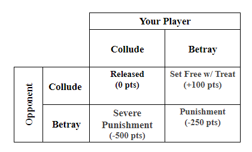

# Prisoners Dilemna
## Game Theory

Video: https://youtu.be/MHS-htjGgSY?si=qRPdKWtVhYSsv0Rl

Game theory is a branch of applied mathematics and economics that deals with the study of strategic decision-making among multiple interdependent and rational decision-makers, known as "players," in situations where the outcome of a participant's choice depends on the choices of others.

Key components of game theory include:

1. **Players:** Individuals or entities making decisions in the context of the game.

2. **Strategies:** The various options or choices available to each player.

3. **Payoffs:** The rewards or outcomes associated with different combinations of strategies chosen by players.

4. **Rules:** The framework or set of rules that govern the game, outlining what actions are permissible and the sequence of play.

Games in game theory can be classified into different types, such as cooperative or non-cooperative games. Non-cooperative games, which are the most common focus of game theory, involve players making decisions independently and without the ability to negotiate or form binding agreements. These games are analyzed using concepts like Nash equilibrium, which is a situation in which each player's strategy is optimal given the strategies of the other players.

The Prisoner's Dilemma is a classic example in game theory. In this scenario, two suspects are arrested and placed in separate cells. Each has the option to either collude and betray the other or stay silent. The outcome depends on the combined decisions made by both suspects. If both remain silent, they receive a lesser sentence. However, if one betrays and the other remains silent, the silent one gets the heaviest sentence, and if both confess, they receive a moderately heavy sentence. The dilemma is that regardless of what the other person does, it is always better for an individual to confess, but if both confess, they both end up worse off than if they had both remained silent.

Game theory has applications in various fields such as economics, biology, political science, and computer science. It helps in understanding strategic decision-making, predicting outcomes, and finding optimal strategies in situations where the actions of others significantly impact the result. It's widely used in analyzing markets, competition, auctions, negotiations, and various real-life scenarios involving multiple decision-makers.

Example of Prisoners Dilemna (Game Show): https://youtu.be/S0qjK3TWZE8?si=7EkQe0syQBabf5mK

## Instructions (You may work with a partner):
- Required Methods:
  - **Look at Last Ten Rounds**: This strategy involves analyzing the opponent's behavior over the last ten rounds. The condition is to check if the opponent's cooperation rate is more than 50% or not. If the opponent has colluded (cooperated) more than half the time in the last ten rounds, the strategy chooses to cooperate. If the opponent's cooperation rate falls below 50%, the strategy will defect.
  - **Last Ten Rounds: React to Sustained Betrayals**: This strategy focuses on observing the opponent's behavior over ten rounds. The condition for this strategy is to look for patterns where the opponent betrays in five consecutive rounds within the last ten rounds. If the opponent exhibits this pattern of five consecutive betrayals, the strategy will choose to betray otherwise collude.
  - **Pavlov**: Pavlov, also known as "Win-Stay, Lose-Switch," begins by cooperating. If you receive a good outcome (both players cooperate or both defect), continue with the same action. If the outcome is bad (opponent defects while you cooperate or vice versa), switch strategies. It's an adaptive strategy that tries to maintain a cooperative stance if it's beneficial.
- Two Methods of Your Own Design

